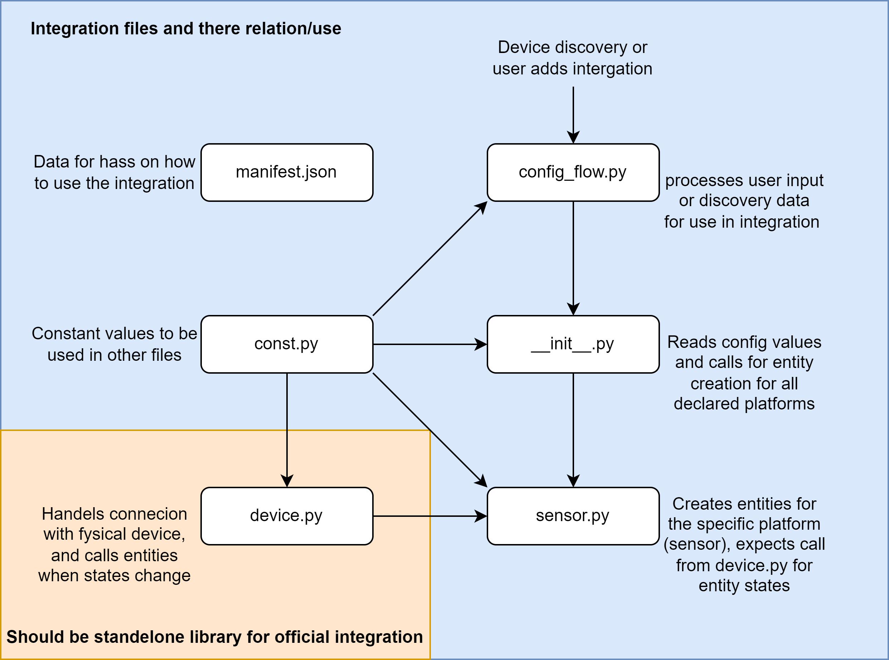

# cdem-hass-integration

This is a custom component for Home Assistant to integrate with [CDem](https://cdem.be) devices.

## Table of Contents

1. [Development](#1-development)
    1. [Prerequisites](#11-prerequisites)
    2. [Installation](#12-installation)
    3. [Usage](#13-usage)
    4. [Testing](#14-testing)
2. [Home Use](#2-home-use)
    1. [Prerequisites](#21-prerequisites)
    2. [Installation](#22-installation)
    3. [Usage](#23-usage)
3. [Troubleshooting](#3-troubleshooting)
4. [TODO](#4-todo)

## 1. Development

### 1.1 Prerequisites

Make sure you have a development environment set up for Home Assistant.
See [Home Assistant Developer Documentation](https://developers.home-assistant.io/docs/development_environment) for more information.

### 1.2 Installation

#### 1.2.1 Install as custom component

1. Copy the contents of the `component` folder to `config/custom_components/` in your Home Assistant installation (create the folder if it does not exist).

#### 1.2.2 Install as home assistant integration

1. Run the following command in a terminal to create a new Home Assistant integration:

    ```bash
    python3 -m script.scaffold integration
    ```

2. When prompted, enter the following information:
    - What is the domain?
        > `cdem`
    - What is the name of your integration?
        > `Connected Digital Energy Meter`
    - What is your GitHub handle?
        > `??` (your GitHub username, @username)
    - What PyPI package and version do you depend on? Leave blank for none.
        > (We are not using any dependencies, so leave this blank)
    - How will your integration gather data?
        > `local_push` (We update the state when the device pushes an update, so we don't need to poll the device)
    - Does Home Assistant need the user to authenticate to control the device/service? (yes/no) [yes]
        > `no` (We don't need to authenticate to control the device)
    - Is the device/service discoverable on the local network? (yes/no) [no]
        > `no` (The device is not discoverable on the local network)
    - Is this a helper integration? (yes/no) [no]
        > `no` (This is not a helper integration)
    - Can the user authenticate the device using OAuth2? (yes/no) [no]
        > `no` (We are using mqtt, so we don't need OAuth2)

3. Wait for the script to finish. (Home Assistant will create all the necessary files for you)
4. Open the folder `homeassistant/components/cdem` in your editor of choice.
5. Replace the contents of this folder with the contents of the `component/cdem` folder from this repository.

### 1.3 Usage

Now that the component is added to your Home Assistant installation, you can start using/developing it.  
More information about developing custom components can be found [here](https://developers.home-assistant.io/docs/creating_component_index).

#### 1.3.1 Additional Information



### 1.4 Testing

When you want to test the code, you can spin up a Home Assistant instance with the custom component installed.  
If your using Visual Studio Code, you can simply press `F5` to start a Home Assistant instance.  
The instance will be available at `http://localhost:8123`.

**Note:**  
When this is the first time you are starting Home Assistant, it will require you to do the initial setup, just like a normal Home Assistant installation.  
This means that you will need to create a user, set a password, etc.

## 2. Home Use

### 2.1 Prerequisites

- A Home Assistant installation.
  For installation instructions, see the [home assistant documentation](https://www.home-assistant.io/installation/).

- A running MQTT broker, either in a docker container, a home assistant addon or some other way.  
  For more information about setting up an MQTT broker, see the [home assistant MQTT documentation](https://www.home-assistant.io/docs/mqtt/broker/).

### 2.2 Installation

#### 2.2.1 When using Home Assistant Container

If your running Home Assistant Container, you can add the component to your installation by following these steps:

1. Make sure Home Assistant is not running.
2. Make sure you have cloned this repository to your local machine and are in the root directory of the repository.
3. Run the following command:
    ```docker cp ./component/ <container_name>:/config/custom_components/```.
    (replace `<container_name>` with the name of your Home Assistant Container)
4. Start Home Assistant.

#### 2.2.2 When using Home Assistant Operating System

If your running Home Assistant Operating System, you can add the component to your installation by following these steps:

1. In your Home Assisant instance, go to Settings > Add-ons.
2. Under the Official add-ons section, you will find the File editor add-on.
3. Click on File editor and click on Install. When the installation is complete, the UI will go to the add-on details page for the file editor.
4. Now start the add-on by clicking on Start.
5. Open the user interface by clicking on Open Web UI.
6. In the File editor, go to the config folder of your Home Assistant installation and create a new folder called `custom_components` (if it doesn't exist already).
7. In this folder just drag and drop the content of the `component` folder from this repository.
8. Restart Home Assistant.

### 2.3 Usage

Now that the component is added to your Home Assistant installation, you can start using it.

#### 2.3.1 Device Setup

1. In your Home Assistant instance, go to Configuration > Integrations.
2. Click on the Add Integration button.
3. Search for `CDem` and click on the CDem integration.
4. Enter the MQTT Topic of your CDem device and the name you would like to use and click on Submit.
5. The integration will now be added to your Home Assistant installation.

#### 2.3.2 Device Information

The integration will create a sensor for each value that is available on the device. For all available values, see the [CDem documentation](https://www.cdem.be/07_operation/#your-data).

## 3. Troubleshooting

- When performing a firmware update, you will need to reload the lvups device in Home Assistant to see the new firmware version.

## 4. TODO

- [ ] Add mqtt discovery
- [ ] Add LWT (last will and testament)
- [ ] Add unit tests (for device and config flow)
- [ ] Change translations (on/off -> high/low tarif, etc.)
- [ ] Move device code to a library (as needed by the Home Assistant Rules and Guidelines)
- [ ] Make the code comply with the Home Assistant Rules and Guidelines (so it may someday be added to Home Assistant)
